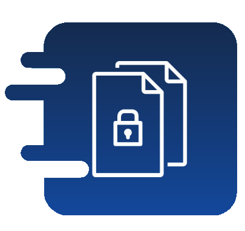
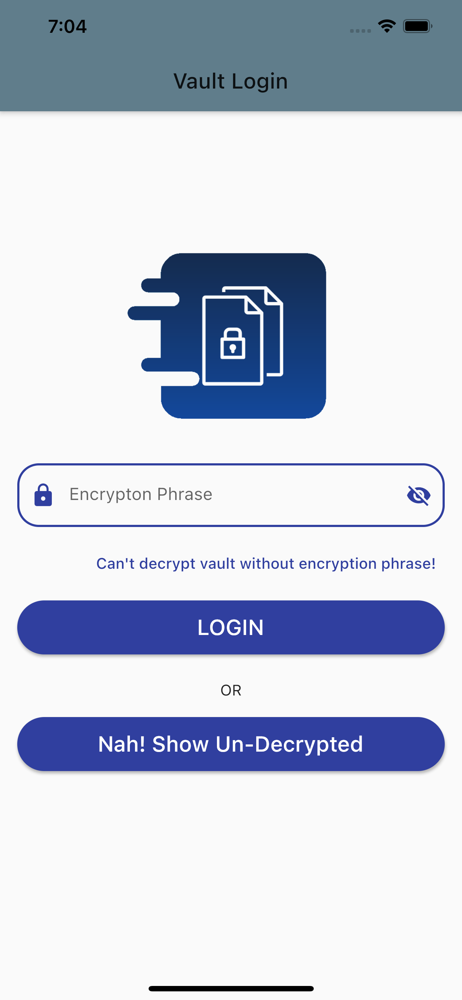
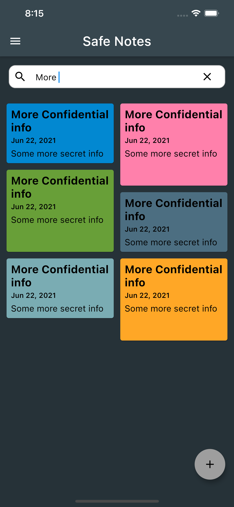
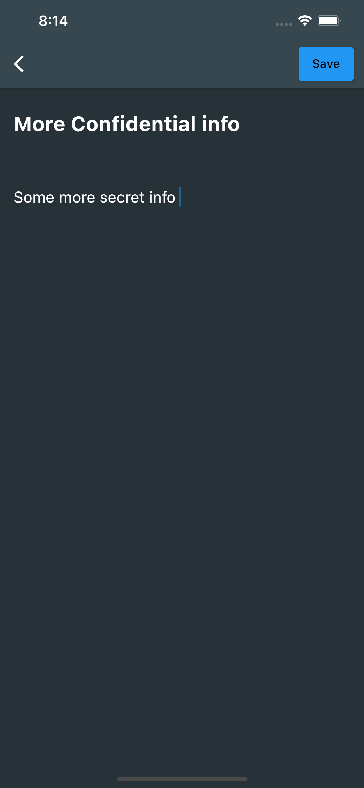

 
<h2 align="center"><b>Safe Notes</b></h2>
<h4 align="center">Encrypted, Private note manager.</h4>

&nbsp;&nbsp;&nbsp;&nbsp;&nbsp;&nbsp;

<a href="#screenshots">Screenshots</a> &bull; <a href="#description">Description</a> &bull; <a href="#features">Features</a> &bull; <a href="#installation-and-updates">Installation and updates</a> &bull; <a href="#contribution">Contribution</a> <!-- &bull; <a href="#donate">Donate</a> --> &bull; <a href="#license">License</a>

<a href="https://keshav-space.github.io/safe_notes/">Website</a> &bull; <a href="https://github.com/keshav-space/safe_notes/blob/main/SECURITY.md">Reporting a Bug</a> &bull; <a href="https://github.com/keshav-space/safe_notes">FAQ</a> &bull; <a href="https://github.com/keshav-space/safe_notes">Press</a>

## Screenshots

| | | | |
|:-------------------------:|:-------------------------:|:-------------------------:|:-------------------------:|
||||| 
|||||

<!--  

 -->

## Description

Safe-Notes is a privacy-focused note manager which provides an inbuild encrypted storage. It imploys rigorously tested  AES-256 encryption standard to store user notes. All the notes are stored locally on the user's device. Contrary to the ongoing frenzy of "move everything to cloud" we believe in "localization of user data" giving you the control of your data and not some third-party cloud service provider.
We know you gotta change your device once in a while that's why Safe-Notes also provides a secure migration facility, which allows you to export and import your notes without having to compromise the sanctity of your data. Yes, Safe-Notes has both Light and Dark modes. Word of advice, keep your passphrase long and secret. May encryption protect us all!

### Features

* Encrypted AES-256 Storage
* Data export both encrypted and unencrypted
* Both encrypted and un-encrypted Import options
* Dark Theme/ Light Theme
* Seamless migration to new device
* Completely anonymous no inbound and outbound request

<!-- Hidden span to keep old links compatible. -->

## Installation and updates
You can install Safe Notes using one of the following methods:
 1. Download Safe Notes from the Google Play store using this [link.](https://play.google.com/store/apps/details?id=com.trisven.safenotes)
 2. Download Safe Notes from the F-Droid using this link.
 3. Download the APK from [Github Releases](https://github.com/keshav-space/safe_notes/releases) and install it.
 4. Build a debug APK yourself. This is the fastest way to get new features on your device, but is much more complicated, so we recommend using one of the other methods.

We recommend method 1 or 2 for most users. APKs installed using method 1 or 3 are compatible with each other. Building a debug APK using method 4 excludes a key entirely. Signing keys help ensure that a user isn't tricked into installing a malicious update to an app.

## Contribution
Whether you have ideas, design changes, code cleaning, or real heavy code changes, help is always welcome.
The more is done the better it gets!

If you'd like to get involved, check our [contribution notes](.github/CONTRIBUTING.md).

## Privacy Policy

The Safe Notes project aims to provide a encrypted, private, anonymous experience for local note storage. The app doesn't send any outbound requests neither does it receives any inbound requests. Therefore, the app doesn't collect any data whatsoever. You can find the document [here](https://keshav-space.github.io/safe_notes/privacy-policy.html).

## License
  

Safe Notes is Free Software: You can use, study share and improve it at your
will. Specifically 
[GNU General Public License](https://www.gnu.org/licenses/gpl.html) as
published by the Free Software Foundation, either version 3 of the License, or
(at your option) any later version.  
